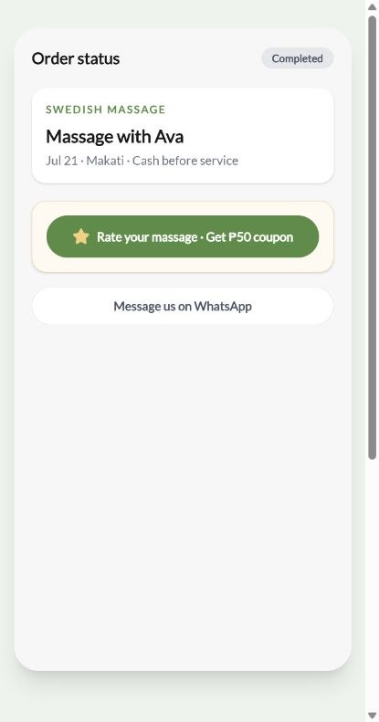
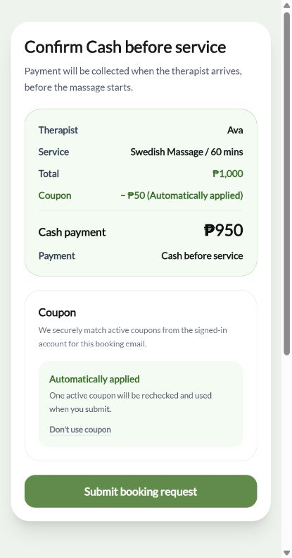

# 优惠券体验闭环交付报告

日期：2026-07-22
范围：`easygospa` 官网 + `ai-office-admin` 公共下单后端
基线图纸：`docs/FIX_BLUEPRINT_COUPON_UX.md`

## 结论

本批三项体验均已完成，并保持批 5 金额/分账函数不变：

- “我的订单”完成单由后端 `reviewStatus` 决定显示评价 CTA 或已评价灰态；评价提交继续由后端一单一评、发券幂等约束裁决。
- Coupons tab 仅在存在 `active` 券时显示红点；active 券卡显示 `Auto-applied on your next booking`。
- 确认下单先请求后端预览；同一登录账号邮箱存在 active 券时，默认显示全额、券抵扣、现金金额，并允许 `Don't use coupon` 退出。最终提交携带已确认的后端金额快照，后端再次匹配并在原子核销路径中复核。

金额与分账红线没有改动。自动用券只改变默认选择与展示，不改变技师、平台、remittance 或 dispatch 的既有计算。

## 逐项对照

### 1. 完成单评价入口

- 未评价完成单：显示 `Rate your massage · Get ₱50 coupon`，可提交 1–5 星和可选评论。
- 已评价完成单：显示灰态 `★★★★★ Reviewed · ₱50 coupon sent`，不再提供提交入口。
- 前端未知/缺失 `reviewStatus` 时不自行放行；后端公开订单投影只返回 `reviewStatus` 与安全的 `reviewStars`。
- 重复评价仍由既有后端 review/coupon 原子服务拒绝，不由前端计数或猜测。

### 2. 券包红点与提示

- 红点条件为 `activeCouponCount > 0`；used/expired 券不会点亮。
- active 券卡增加 `Auto-applied on your next booking`。
- 评价成功后重新读取订单和券包，后端状态变化会驱动 CTA/红点更新。

### 3. 确认步自动用券

- 前端仍提交完整目录价，不在浏览器内减钱。
- 后端预览返回并由官网安全投影：`grossServiceAmount`、`couponDiscount`、`cashToCollect`、`couponApplied`。
- 有券示例：`₱1,000` / `− ₱50 (Automatically applied)` / `₱950`。
- 无券：仅显示全额，不显示券抵扣和现金差额行。
- 选择 `Don't use coupon`：后端预览全额，最终 guarded RPC 明确要求不带券，券保持 active。
- 最终提交携带 `expectedCouponApplied`、`expectedGrossServiceAmount`、`expectedCashToCollect`；预览变化时返回安全的 `COUPON_PREVIEW_CHANGED` 409，官网刷新后要求客人再次确认。

## 图纸安全纠偏

图纸把“游客仅填邮箱，由后端按 customerKey 自动匹配”列为推荐路径。仅凭公开表单邮箱无法证明券归属，照做会允许伪造他人邮箱试用其券。因此本实现收窄为：

- 自动查券前必须验证 Supabase Bearer 身份；token 邮箱必须与本次下单邮箱一致。
- 未登录或邮箱不一致时不查券、不暴露券信息、不自动抵扣；官网提示用该下单邮箱登录 My orders。
- 显式伪造 `couponId` 但没有匹配身份同样 fail-closed。

这是对图纸的安全纠偏：已登录同邮箱路径完成自动用券；游客只填邮箱路径保持全价，不冒用券。

## 后端权威、并发与幂等

- 选择哪一张 active 券、归属、到期、核销和最终 booking/coupon 状态均由后端决定。
- 新迁移 `031_coupon_preview_guard.sql` 先使用与迁移 030 相同的 booking advisory lock，再锁 coupon 行，避免 guarded/legacy 调用锁序反转。
- 同一 booking 重试由相同 advisory key 串行，先前成功的 booking 是权威结果，不会核销第二张券。
- 不同 booking 抢同一张券时，coupon `FOR UPDATE` 串行；输家返回 409，不写 booking、不核销 coupon。
- 031 只做锁定/期望校验，并委托未修改的 030 `create_public_booking_with_coupon` 执行既有金额与核销逻辑。

边界说明：Supabase 现有 public intake 在最终 booking RPC 前还会 upsert customer/thread/message 并预留 shortRef；它们不在同一个数据库事务中。因此这里准确承诺的是“409 不写 booking、不核销 coupon”，不宣称整个 HTTP 请求零业务写入。把全部 intake 副表纳入单一事务壳属于另一批架构改造，不在本图纸范围内。

## 金额红线证据

命令：

```text
node scripts/check-review-coupon-loop.mjs
```

输出：

```text
[review-coupon-loop] MONEY_REDLINE gross=₱1000 dispatch=₱1000 commission_base=₱1000 remittance_basis=₱1000 actual_cash=₱950 technician=₱400 platform=₱550 remit_due=₱550 cash=₱950
[review-coupon-loop] ALL_ASSERTIONS_PASS
```

官网闭环脚本：

```text
node scripts/check-website-review-coupon-loop.mjs
WEBSITE_REVIEW_COUPON_LOOP_CHECK_PASS
```

以上证明仍为：dispatch/commission/remittance 基数全额 ₱1,000；实际现金 ₱950；技师 ₱400；平台 ₱550。

## 验收结果

| 验收项 | 结果 |
|---|---|
| 官网 `npm run build` | PASS，21/21 静态页生成完成 |
| 后端 `npm run build` | PASS，100/100 静态页生成完成 |
| 官网 `npm run lint` | PASS，0 error；4 条既有 warning |
| `check-website-review-coupon-loop.mjs` | PASS |
| `check-review-coupon-loop.mjs` | PASS，含金额红线、身份拒绝、自动/无券/退出、重复提交、stale preview booking/coupon 零写检查 |
| `check-my-bookings.mjs` | PASS，含 reviewed/unreviewed 后端状态 |
| `check-public-booking-status.mjs` | PASS，含公开字段 allowlist |
| `check-p0-public-booking-response.mjs` | PASS |
| `check-rate-limits.mjs` | `ALL_LOCAL_ASSERTIONS_PASS`；preview 使用独立限流桶 |
| `git diff --check` | PASS（仅 Git 行尾转换提示） |
| 独立并发/SQL 复审 | PASS，当前无 Critical/Important |

本地浏览器证据使用实际导出的生产组件挂载到临时 evidence 页面，确认精确 DOM 文案与可见组件后截图；临时页面已删除，交付代码中不保留测试路由。三张页面均正常挂载，无黑屏。开发环境无法连接 Google Fonts 时使用 fallback font，不影响组件运行与截图内容。

## 截图

### 完成单评价 CTA



### 券包 active 红点


### 确认步自动抵扣



## 部署顺序与未冒充的证据

1. `ai-office-admin` 先应用迁移 031，再部署包含 guarded RPC 调用的后端代码。
2. 后端生效后再部署 `easygospa`，因为最终官网提交都会携带 coupon expectation。
3. 本批已完成本地脚本、构建、组件浏览器运行和独立静态并发审查；未在真实 Supabase 执行 031，也未做双会话数据库竞争或已部署站点 smoke。
4. `check-rate-limits.mjs` 的可选 durable-atomic gate 仍明确输出：`BLOCKED DURABLE_ATOMIC_UNVERIFIED migration 029 must be applied to an isolated Supabase before running --durable-atomic`。这不是本地断言失败，但不能当作真实数据库并发证明。
